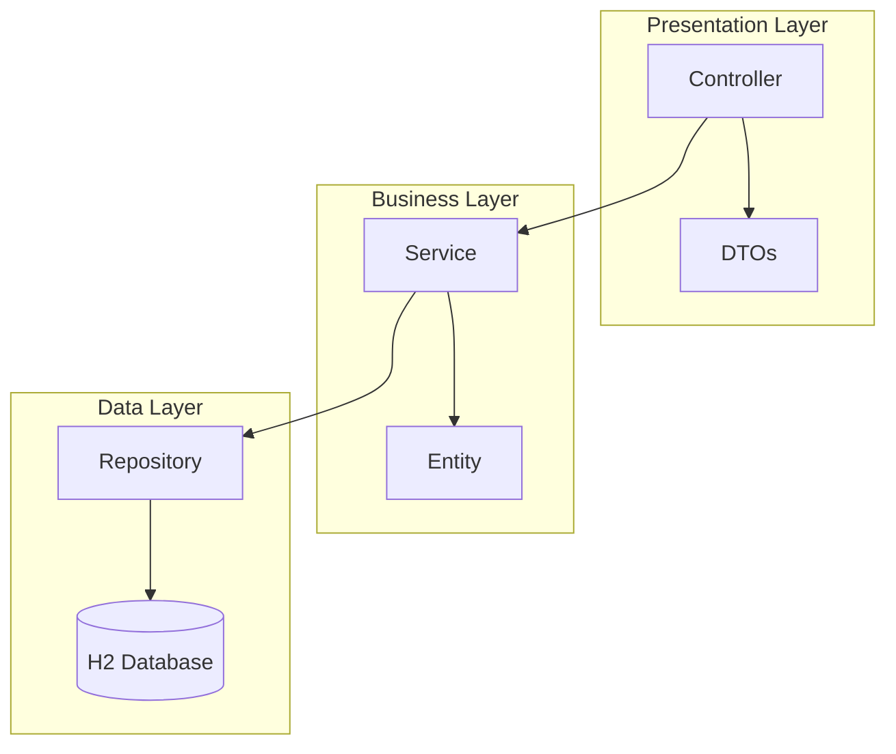
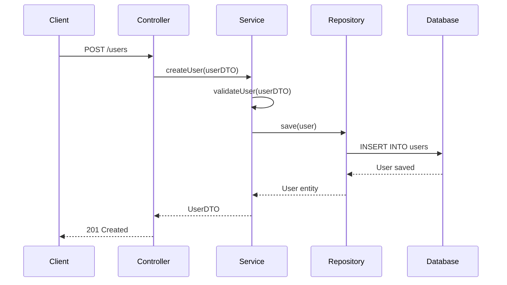
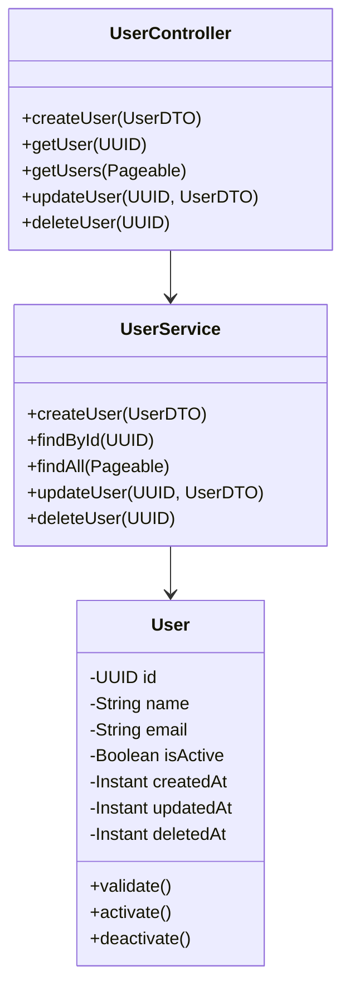

# 🚀 API de Cadastro de Usuários - Grupo Business Brasil

Uma API REST robusta desenvolvida em **Java Spring Boot** para o desafio técnico do Grupo Business Brasil, implementando operações CRUD completas para gerenciamento de usuários com arquitetura MVC e padrões de qualidade enterprise.

## 📋 Índice

- [Visão Geral](#-visão-geral)
- [Arquitetura](#-arquitetura)
- [Tecnologias](#-tecnologias)
- [Estrutura do Projeto](#-estrutura-do-projeto)
- [Banco de Dados](#-banco-de-dados)
- [Endpoints](#-endpoints)
- [Instalação e Execução](#-instalação-e-execução)
- [Docker](#-docker)
- [Testes](#-testes)
- [CI/CD](#-cicd)
- [Documentação da API](#-documentação-da-api)
- [Diagramas](#-diagramas)

## 🎯 Visão Geral

Esta API implementa um sistema completo de cadastro de usuários seguindo os princípios REST e padrões de arquitetura enterprise. O projeto foi desenvolvido com foco em **escalabilidade**, **manutenibilidade** e **qualidade de código**.

### Funcionalidades Principais

- ✅ **Cadastrar usuário** - `POST /api/v1/users`
- ✅ **Listar usuários** - `GET /api/v1/users` (com paginação)
- ✅ **Buscar usuário por ID** - `GET /api/v1/users/{id}`
- ✅ **Atualizar usuário** - `PUT /api/v1/users/{id}`
- ✅ **Soft delete** - `DELETE /api/v1/users/{id}`
- ✅ **Validação de email** robusta
- ✅ **Auditoria completa** (LGPD compliant)
- ✅ **Tratamento de erros** padronizado (RFC 7807)

## 🏗️ Arquitetura

### Decisões Arquiteturais

**Arquitetura MVC** foi escolhida por ser adequada para projetos de pequeno a médio porte, oferecendo:
- **Simplicidade** e facilidade de manutenção
- **Separação clara** de responsabilidades
- **Escalabilidade** suficiente para os requisitos atuais

> **Nota:** Para sistemas de grande escala, recomenda-se **DDD (Domain-Driven Design)**, **Clean Architecture** ou **Arquitetura Hexagonal**, dependendo do contexto e complexidade do domínio.

### Camadas da Aplicação

```
┌─────────────────┐
│   Controller    │ ← Camada de apresentação (REST endpoints)
├─────────────────┤
│    Service      │ ← Camada de negócio (regras e validações)
├─────────────────┤
│   Repository    │ ← Camada de acesso a dados (JPA/Hibernate)
├─────────────────┤
│   Database      │ ← Banco de dados (H2 in-memory)
└─────────────────┘
```

## 🛠️ Tecnologias

### Backend
- **Java 17** - Linguagem principal
- **Spring Boot 3.x** - Framework principal
- **Spring Web** - Servidor web e REST APIs
- **Spring Data JPA** - ORM e acesso a dados
- **H2 Database** - Banco em memória
- **Flyway** - Migração de banco de dados
- **Docker** - Containerização

### Testes
- **JUnit 5** - Framework de testes
- **Mockito** - Mocking de dependências
- **TestContainers** - Testes de integração

### DevOps
- **GitHub Actions** - CI Pipeline
- **Docker Compose** - Orquestração de containers

## 📁 Estrutura do Projeto

```
src/
├── main/
│   ├── java/
│   │   └── com/
│   │       └── businessbrasil/
│   │           └── api/
│   │               ├── controller/     # REST Controllers
│   │               ├── service/        # Business Logic
│   │               ├── repository/    # Data Access Layer
│   │               ├── entity/         # JPA Entities
│   │               ├── dto/           # Data Transfer Objects
│   │               ├── exception/     # Custom Exceptions
│   │               ├── config/        # Configuration Classes
│   │               └── ApiApplication.java
│   └── resources/
│       ├── application.yml
│       ├── db/migration/              # Flyway migrations
│       └── static/
└── test/
    └── java/
        └── com/businessbrasil/api/
            ├── controller/
            ├── service/
            └── repository/
```

## 🗄️ Banco de Dados

### H2 Database

O **H2** foi escolhido por ser um banco relacional em memória que simula perfeitamente um banco real, oferecendo:

- **SQL padrão** - Compatível com PostgreSQL, MySQL, etc.
- **Interface web** - Console administrativo integrado
- **Performance** - Extremamente rápido para desenvolvimento e testes
- **Zero configuração** - Funciona out-of-the-box

### Estrutura da Tabela

```sql
CREATE TABLE users (
    id UUID PRIMARY KEY,
    name VARCHAR(255) NOT NULL,
    email VARCHAR(255) UNIQUE NOT NULL,
    is_active BOOLEAN DEFAULT TRUE,
    created_at TIMESTAMP NOT NULL,
    updated_at TIMESTAMP,
    deleted_at TIMESTAMP
);

-- Índices para otimização
CREATE INDEX idx_users_email ON users(email);
CREATE INDEX idx_users_active ON users(is_active);
CREATE INDEX idx_users_created_at ON users(created_at);
```

### Campos da Entidade

| Campo | Tipo | Descrição |
|-------|------|-----------|
| `id` | UUID | Identificador único (gerado automaticamente) |
| `name` | String | Nome do usuário (obrigatório) |
| `email` | String | Email único (obrigatório e validado) |
| `is_active` | Boolean | Status ativo/inativo (soft delete) |
| `created_at` | Instant | Data de criação (auditoria) |
| `updated_at` | Instant | Data da última atualização |
| `deleted_at` | Instant | Data de exclusão lógica |

> **Nota:** Palavras reservadas como `user` são evitadas usando `users` como nome da tabela.

## 🔗 Endpoints

### Base URL
```
http://localhost:8080/api/v1
```

### Endpoints Disponíveis

| Método | Endpoint | Descrição |
|--------|----------|-----------|
| `POST` | `/users` | Criar novo usuário |
| `GET` | `/users` | Listar usuários (paginado) |
| `GET` | `/users/{id}` | Buscar usuário por ID |
| `PUT` | `/users/{id}` | Atualizar usuário |
| `DELETE` | `/users/{id}` | Excluir usuário (soft delete) |

### Exemplos de Uso

#### Criar Usuário
```bash
curl -X POST http://localhost:8080/api/v1/users \
  -H "Content-Type: application/json" \
  -d '{
    "name": "João Silva",
    "email": "joao@email.com"
  }'
```

#### Listar Usuários
```bash
curl -X GET "http://localhost:8080/api/v1/users?page=0&size=10"
```

#### Buscar por ID
```bash
curl -X GET http://localhost:8080/api/v1/users/{uuid}
```

## 🚀 Instalação e Execução

### Pré-requisitos

- **Java 17+**
- **Maven 3.6+**
- **Docker** (opcional)

### Execução Local

1. **Clone o repositório**
```bash
git clone https://github.com/seu-usuario/api-cadastro-usuarios.git
cd api-cadastro-usuarios
```

2. **Configure as variáveis de ambiente**
```bash
cp .env.example .env
# Edite o arquivo .env com suas configurações
```

3. **Execute a aplicação**
```bash
mvn spring-boot:run
```

4. **Acesse a aplicação**
- API: http://localhost:8080
- H2 Console: http://localhost:8080/h2-console

### Execução com Docker

```bash
# Build e execução
docker-compose up --build

# Ou apenas execução
docker-compose up
```

## 🐳 Docker

### Dockerfile
```dockerfile
FROM openjdk:17-jdk-slim
COPY target/api-cadastro-usuarios-*.jar app.jar
EXPOSE 8080
ENTRYPOINT ["java", "-jar", "/app.jar"]
```

### Docker Compose
```yaml
version: '3.8'
services:
  api:
    build: .
    ports:
      - "8080:8080"
    environment:
      - SPRING_PROFILES_ACTIVE=docker
```

## 🧪 Testes

### Executar Testes

```bash
# Todos os testes
mvn test

# Testes com coverage
mvn test jacoco:report

# Testes de integração
mvn verify
```

### Estrutura de Testes

- **Unit Tests** - Testam componentes isoladamente
- **Integration Tests** - Testam fluxos completos
- **Controller Tests** - Testam endpoints REST
- **Repository Tests** - Testam acesso a dados

### Coverage

O projeto mantém **cobertura de testes > 80%** garantida pelo pipeline CI/CD.

## 🔄 CI

### GitHub Actions Pipeline

O projeto inclui pipeline automatizado que executa:

1. **Checkout** do código
2. **Setup** Java 17
3. **Cache** de dependências Maven
4. **Testes** unitários e integração
5. **Build** da aplicação
6. **Deploy** automático (se necessário)

### Workflow

```yaml
name: CI/CD Pipeline
on: [push, pull_request]
jobs:
  test:
    runs-on: ubuntu-latest
    steps:
      - uses: actions/checkout@v3
      - name: Setup Java
        uses: actions/setup-java@v3
        with:
          java-version: '17'
      - name: Run Tests
        run: mvn test
      - name: Generate Coverage Report
        run: mvn jacoco:report
```

## 📚 Documentação da API

### Swagger/OpenAPI

A documentação interativa está disponível em:
- **Swagger UI**: http://localhost:8080/swagger-ui.html
- **OpenAPI JSON**: http://localhost:8080/v3/api-docs

### Padrão de Respostas

#### Sucesso
```json
{
  "success": true,
  "message": "Operação realizada com sucesso",
  "data": { ... },
  "timestamp": "2024-01-15T10:30:00Z"
}
```

#### Erro (RFC 7807)
```json
{
  "type": "https://api.businessbrasil.com/problems/validation-error",
  "title": "Validation Error",
  "status": 400,
  "detail": "Email inválido",
  "instance": "/api/v1/users",
  "timestamp": "2024-01-15T10:30:00Z"
}
```

## 📊 Diagramas

### Diagrama de Arquitetura



### Diagrama de Sequência - Criar Usuário



### Diagrama de Classes



## 🎯 Critérios de Avaliação

| Critério | Peso | Status |
|----------|------|--------|
| **Lógica e funcionamento** | 40% | ✅ Implementado |
| **Clareza e organização do código** | 30% | ✅ Implementado |
| **Uso correto de rotas REST** | 15% | ✅ Implementado |
| **Instruções claras de execução** | 10% | ✅ Implementado |
| **Extras (validações, testes)** | 5% | ✅ Implementado |

## 🔧 Configurações

### Variáveis de Ambiente (.env)

```env
# Database
DB_URL=jdbc:h2:mem:testdb
DB_USERNAME=sa
DB_PASSWORD=

# Server
SERVER_PORT=8080
SERVER_CONTEXT_PATH=/api/v1

# Logging
LOG_LEVEL=INFO
LOG_PATTERN=%d{yyyy-MM-dd HH:mm:ss} - %msg%n
```

## 📈 Próximos Passos

Para escalar a aplicação, considere:

- **Cache** (Redis) para consultas frequentes
- **Banco distribuído** (PostgreSQL/MySQL) com replicação
- **Message Queue** (RabbitMQ/Kafka) para processamento assíncrono
- **API Gateway** para rate limiting e autenticação
- **Monitoring** (Prometheus + Grafana)
- **Logs centralizados** (ELK Stack)

## 🔄 Git Workflow

Este projeto utiliza **GitFlow** como estratégia de branching e **Commits Semânticos** para padronização:

### GitFlow
- **main** - Branch principal com código em produção
- **develop** - Branch de desenvolvimento
- **feature/** - Novas funcionalidades
- **hotfix/** - Correções urgentes
- **release/** - Preparação para releases

### Commits Semânticos
```
feat: adiciona endpoint para criar usuário
fix: corrige validação de email
docs: atualiza documentação da API
test: adiciona testes para UserService
refactor: melhora estrutura do UserController
```

### Versionamento Semântico
Seguimos o padrão **SemVer** (Semantic Versioning):
- **MAJOR** - Mudanças incompatíveis
- **MINOR** - Novas funcionalidades compatíveis
- **PATCH** - Correções de bugs

Exemplo: `v1.2.3` → `v1.3.0` (nova feature)

## 👥 Contribuição

1. Fork o projeto
2. Crie uma branch seguindo o GitFlow (`git checkout -b feature/nova-funcionalidade`)
3. Faça commits semânticos (`git commit -m 'feat: adiciona validação de CPF'`)
4. Push para a branch (`git push origin feature/nova-funcionalidade`)
5. Abra um Pull Request seguindo o template

## 📄 Licença

Este projeto está sob a licença MIT. Veja o arquivo [LICENSE](LICENSE) para mais detalhes.

## 📞 Contato

**Grupo Business Brasil**
- 📧 Email: rh@grupobusinessbrasil.com.br
- 📱 Telefone: 11 99524-0071
- 🏢 Endereço: Rua Dr. Renato Paes de Barros, 618 – Conj. 01 – Itaim Bibi – São Paulo/SP

---

<div align="center">
  <p>Desenvolvido com ❤️ por <strong>Alex Caje Felix</strong> para o processo seletivo do <strong>Grupo Business Brasil</strong></p>
  <p>© 2025 - Todos os direitos reservados</p>
</div>
