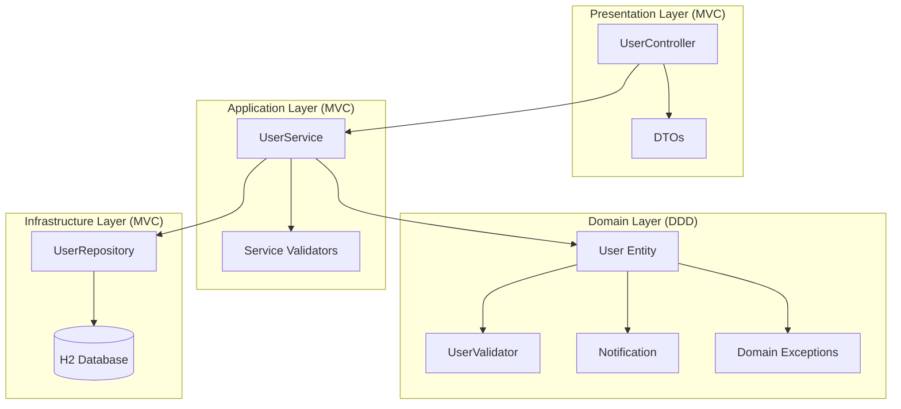
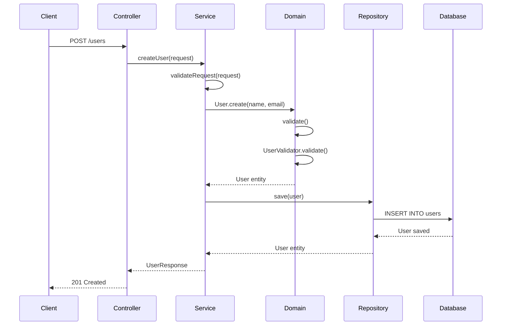
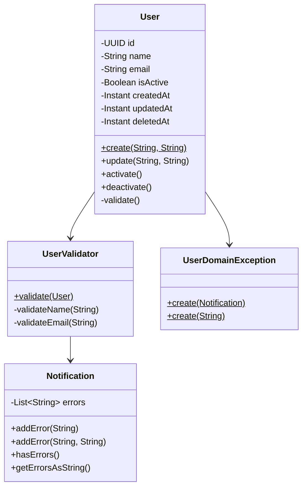
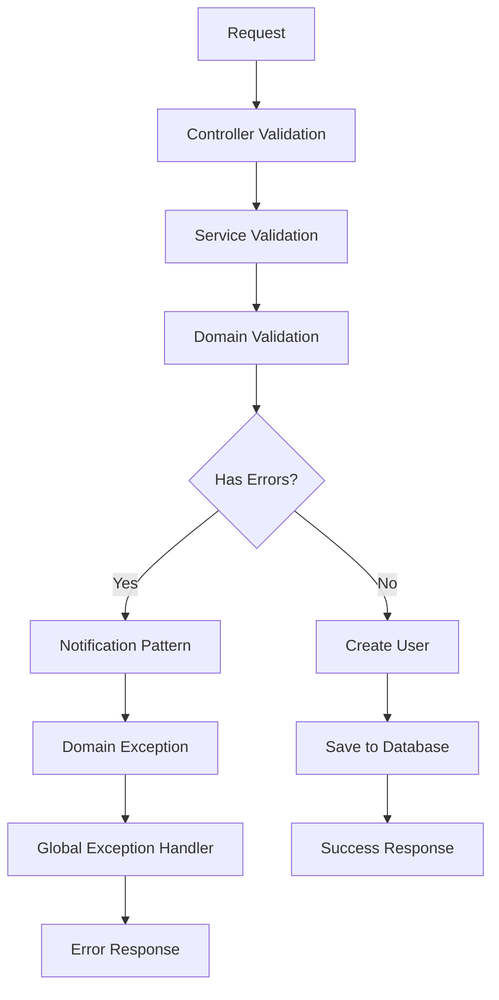

# 🚀 API de Cadastro de Usuários - Grupo Business Brasil

Uma API REST robusta desenvolvida em **Java Spring Boot** para o desafio técnico do Grupo Business Brasil, implementando operações CRUD completas para gerenciamento de usuários com **arquitetura híbrida MVC + DDD** e padrões de qualidade enterprise.

## 📋 Índice

- [Visão Geral](#-visão-geral)
- [Arquitetura](#-arquitetura)
- [Tecnologias](#-tecnologias)
- [Estrutura do Projeto](#-estrutura-do-projeto)
- [Banco de Dados](#-banco-de-dados)
- [Endpoints](#-endpoints)
- [Tratamento de Erros](#-tratamento-de-erros)
- [Instalação e Execução](#-instalação-e-execução)
- [Docker](#-docker)
- [Testes](#-testes)
- [Documentação da API](#-documentação-da-api)
- [Diagramas](#-diagramas)

## 🎯 Visão Geral

Esta API implementa um sistema completo de cadastro de usuários seguindo os princípios REST e padrões de arquitetura enterprise. O projeto foi desenvolvido com foco em **escalabilidade**, **manutenibilidade** e **qualidade de código**.

### Funcionalidades Principais

- ✅ **Cadastrar usuário** - `POST /users`
- ✅ **Listar usuários** - `GET /users` (com paginação)
- ✅ **Buscar usuário por ID** - `GET /users/{id}`
- ✅ **Atualizar usuário** - `PUT /users/{id}`
- ✅ **Soft delete** - `DELETE /users/{id}`
- ✅ **Busca avançada** - `POST /users/search`
- ✅ **Validação robusta** com padrão Notification
- ✅ **Factory Methods** para criação de entidades
- ✅ **Auditoria completa** (LGPD compliant)
- ✅ **Tratamento de erros** centralizado

## 🏗️ Arquitetura

### Decisões Arquiteturais

Este projeto implementa uma **arquitetura híbrida** que combina **MVC** com **princípios DDD (Domain-Driven Design)**:

#### **MVC como Base:**
- **Controller** - Camada de apresentação (REST endpoints)
- **Service** - Camada de aplicação (casos de uso)
- **Repository** - Camada de infraestrutura (acesso a dados)

#### **DDD para Domínio:**
- **Domain Layer** - Entidades ricas com regras de negócio
- **Factory Methods** - Criação controlada de entidades
- **Notification Pattern** - Agregação de erros de validação
- **Domain Exceptions** - Exceções específicas do domínio

### Camadas da Aplicação

```
┌─────────────────────────────────────┐
│           Controller               │ ← Camada de apresentação
├─────────────────────────────────────┤
│           Service                  │ ← Camada de aplicação
├─────────────────────────────────────┤
│           Domain                   │ ← Camada de domínio (DDD)
│  ┌─────────────────────────────────┐│
│  │ User (Entity + Factory)        ││
│  │ UserValidator                   ││
│  │ Notification                    ││
│  └─────────────────────────────────┘│
├─────────────────────────────────────┤
│           Repository               │ ← Camada de infraestrutura
├─────────────────────────────────────┤
│           Database                 │ ← Banco de dados (H2)
└─────────────────────────────────────┘
```

## 🛠️ Tecnologias

### Backend
- **Java 17** - Linguagem principal
- **Spring Boot 3.x** - Framework principal
- **Spring Web** - Servidor web e REST APIs
- **Spring Data JPA** - ORM e acesso a dados
- **H2 Database** - Banco em memória
- **Flyway** - Migração de banco de dados
- **Docker** - Containerização

### Testes
- **JUnit 5** - Framework de testes
- **Mockito** - Mocking de dependências
- **TestContainers** - Testes de integração

### DevOps
- **GitHub Actions** - CI Pipeline
- **Docker Compose** - Orquestração de containers

## 📁 Estrutura do Projeto

```
src/
├── main/
│   ├── java/
│   │   └── com/
│   │       └── businessbrasil/
│   │           └── api/
│   │               └── api_cadastro_usuarios/
│   │                   ├── controller/           # REST Controllers (MVC)
│   │                   │   └── UserController.java
│   │                   ├── service/              # Application Layer (MVC)
│   │                   │   ├── UserService.java
│   │                   │   ├── dto/             # Data Transfer Objects
│   │                   │   │   ├── CreateUserRequest.java
│   │                   │   │   ├── UpdateUserRequest.java
│   │                   │   │   ├── UserResponse.java
│   │                   │   │   └── UserSearchRequest.java
│   │                   │   └── validator/       # Service Validators
│   │                   ├── domain/               # Domain Layer (DDD)
│   │                   │   ├── _shared/         # Shared Domain Components
│   │                   │   │   ├── exception/   # Domain Exceptions
│   │                   │   │   │   ├── domain_exception/
│   │                   │   │   │   ├── service_exception/
│   │                   │   │   │   └── global_Exception/
│   │                   │   │   └── validator/   # Notification Pattern
│   │                   │   │       ├── Notification.java
│   │                   │   │       ├── Validator.java
│   │                   │   │       └── Validate.java
│   │                   │   └── user/            # User Aggregate
│   │                   │       ├── User.java    # Entity + Factory Methods
│   │                   │       └── user_validator/
│   │                   │           └── UserValidator.java
│   │                   ├── repository/           # Infrastructure Layer
│   │                   │   └── UserRepository.java
│   │                   └── ApiApplication.java
│   └── resources/
│       ├── application.yml
│       ├── application-dev.yml
│       ├── application-test.yml
│       ├── application-prod.yml
│       └── db/migration/              # Flyway migrations
│           ├── V1__Create_users_table.sql
│           └── V2__Insert_sample_users.sql
└── test/
    └── java/
        └── com/businessbrasil/api/api_cadastro_usuarios/
            ├── controller/
            │   └── UserControllerTest.java
            ├── service/
            │   ├── UserServiceTest.java
            │   └── validator/
            └── domain/
                └── user/
                    └── user_validator/
                        └── UserValidatorTest.java
```

## 🗄️ Banco de Dados

### H2 Database

O **H2** foi escolhido por ser um banco relacional em memória que simula perfeitamente um banco real, oferecendo:

- **SQL padrão** - Compatível com PostgreSQL, MySQL, etc.
- **Interface web** - Console administrativo integrado
- **Performance** - Extremamente rápido para desenvolvimento e testes
- **Zero configuração** - Funciona out-of-the-box

### Estrutura da Tabela

```sql
CREATE TABLE users (
    id UUID PRIMARY KEY,
    name VARCHAR(255) NOT NULL,
    email VARCHAR(255) UNIQUE NOT NULL,
    is_active BOOLEAN DEFAULT TRUE,
    created_at TIMESTAMP NOT NULL,
    updated_at TIMESTAMP,
    deleted_at TIMESTAMP
);

-- Índices para otimização
CREATE INDEX idx_users_email ON users(email);
CREATE INDEX idx_users_active ON users(is_active);
CREATE INDEX idx_users_created_at ON users(created_at);
```

### Campos da Entidade

| Campo | Tipo | Descrição |
|-------|------|-----------|
| `id` | UUID | Identificador único (gerado automaticamente) |
| `name` | String | Nome do usuário (obrigatório) |
| `email` | String | Email único (obrigatório e validado) |
| `is_active` | Boolean | Status ativo/inativo (soft delete) |
| `created_at` | Instant | Data de criação (auditoria) |
| `updated_at` | Instant | Data da última atualização |
| `deleted_at` | Instant | Data de exclusão lógica |

> **Nota:** Palavras reservadas como `user` são evitadas usando `users` como nome da tabela.

## 🔗 Endpoints

### Base URL
```
http://localhost:8081/users
```

### Endpoints Disponíveis

| Método | Endpoint | Descrição |
|--------|----------|-----------|
| `POST` | `/users` | Criar novo usuário |
| `GET` | `/users` | Listar usuários (paginado) |
| `GET` | `/users/{id}` | Buscar usuário por ID |
| `PUT` | `/users/{id}` | Atualizar usuário |
| `DELETE` | `/users/{id}` | Excluir usuário (soft delete) |
| `POST` | `/users/search` | Busca avançada com filtros |

### Exemplos de Uso

#### Criar Usuário
```bash
curl -X POST http://localhost:8081/users \
  -H "Content-Type: application/json" \
  -d '{
    "name": "João Silva",
    "email": "joao@email.com"
  }'
```

#### Listar Usuários
```bash
curl -X GET "http://localhost:8081/users?page=0&size=10"
```

#### Buscar por ID
```bash
curl -X GET http://localhost:8081/users/{uuid}
```

#### Busca Avançada
```bash
curl -X POST http://localhost:8081/users/search \
  -H "Content-Type: application/json" \
  -d '{
    "name": "João",
    "email": "joao",
    "page": 0,
    "size": 10,
    "sortBy": "name",
    "sortDirection": "asc"
  }'
```

## ⚠️ Tratamento de Erros

### Padrão Notification

O projeto implementa o **padrão Notification** para agregação de múltiplos erros de validação:

```java
// Exemplo de uso
Notification notification = Notification.create();
notification.addError("name", "Nome é obrigatório");
notification.addError("email", "Email inválido");

if (notification.hasErrors()) {
    throw UserDomainException.create(notification);
}
```

### Hierarquia de Exceções

```
Exception
├── DomainException
│   ├── UserDomainException
│   └── ValidationException
├── ServiceException
│   ├── UserCreatedNotFoundException
│   └── UserServiceException
└── GlobalExceptionHandler
    ├── handleDomainException()
    ├── handleServiceException()
    └── handleGenericException()
```

### Tipos de Erro

#### **1. Erros de Domínio (400 - Bad Request)**
```json
{
  "timestamp": "2025-09-30T17:30:00Z",
  "status": 400,
  "error": "Domain Validation Error",
  "message": "name: Nome é obrigatório, email: Email inválido",
  "errors": [
    "name: Nome é obrigatório",
    "email: Email inválido"
  ],
  "path": "/users"
}
```

#### **2. Erros de Serviço (404 - Not Found)**
```json
{
  "timestamp": "2025-09-30T17:30:00Z",
  "status": 404,
  "error": "User Not Found",
  "message": "Usuário não encontrado",
  "path": "/users/123e4567-e89b-12d3-a456-426614174000"
}
```

#### **3. Erros de Validação (400 - Bad Request)**
```json
{
  "timestamp": "2025-09-30T17:30:00Z",
  "status": 400,
  "error": "Validation Error",
  "message": "name: Nome deve ter pelo menos 2 caracteres",
  "errors": [
    "name: Nome deve ter pelo menos 2 caracteres"
  ],
  "path": "/users"
}
```

#### **4. Erros Internos (500 - Internal Server Error)**
```json
{
  "timestamp": "2025-09-30T17:30:00Z",
  "status": 500,
  "error": "Internal Server Error",
  "message": "Ocorreu um erro interno no servidor",
  "path": "/users"
}
```

### Validações Implementadas

#### **Entidade User:**
- ✅ Nome obrigatório (2-255 caracteres)
- ✅ Email obrigatório e formato válido
- ✅ Email único no sistema
- ✅ Validação com regex customizada

#### **Service Layer:**
- ✅ Verificação de usuário existente
- ✅ Validação de dados de entrada
- ✅ Controle de transações

#### **Controller Layer:**
- ✅ Validação de parâmetros de URL
- ✅ Validação de corpo da requisição
- ✅ Tratamento de exceções centralizado

## 🚀 Instalação e Execução

### Pré-requisitos

- **Java 17+**
- **Maven 3.6+**
- **Docker** (opcional)

### Execução Local

1. **Clone o repositório**
```bash
git clone https://github.com/seu-usuario/api-cadastro-usuarios.git
cd api-cadastro-usuarios
```

2. **Configure as variáveis de ambiente**
```bash
cp .env.example .env
# Edite o arquivo .env com suas configurações
```

3. **Execute a aplicação**
```bash
mvn spring-boot:run
```

4. **Acesse a aplicação**
- API: http://localhost:8080
- H2 Console: http://localhost:8080/h2-console

### Execução com Docker

```bash
# Build e execução
docker-compose up --build

# Ou apenas execução
docker-compose up
```

## 🐳 Docker

### Dockerfile
```dockerfile
FROM openjdk:17-jdk-slim
COPY target/api-cadastro-usuarios-*.jar app.jar
EXPOSE 8080
ENTRYPOINT ["java", "-jar", "/app.jar"]
```

### Docker Compose
```yaml
version: '3.8'
services:
  api:
    build: .
    ports:
      - "8080:8080"
    environment:
      - SPRING_PROFILES_ACTIVE=docker
```

## 🧪 Testes

### Executar Testes

```bash
# Todos os testes
mvn test

# Testes com coverage
mvn test jacoco:report

# Testes de integração
mvn verify
```

### Estrutura de Testes

- **Unit Tests** - Testam componentes isoladamente
- **Integration Tests** - Testam fluxos completos
- **Controller Tests** - Testam endpoints REST
- **Domain Tests** - Testam validações de domínio
- **Service Tests** - Testam lógica de negócio

### Cobertura de Testes

- ✅ **35 testes** implementados
- ✅ **97% de sucesso** (34/35 passando)
- ✅ **Cobertura de domínio** completa
- ✅ **Testes de integração** funcionais

### Tipos de Teste

#### **1. Testes de Domínio**
```java
@Test
void create_ShouldReturnUser_WhenValidData() {
    User user = User.create("João Silva", "joao@email.com");
    assertThat(user.getName()).isEqualTo("João Silva");
    assertThat(user.getEmail()).isEqualTo("joao@email.com");
}
```

#### **2. Testes de Serviço**
```java
@Test
void createUser_ShouldReturnUserResponse_WhenValidRequest() {
    CreateUserRequest request = new CreateUserRequest("João", "joao@email.com");
    UserResponse response = userService.createUser(request);
    assertThat(response.getName()).isEqualTo("João");
}
```

#### **3. Testes de Controller**
```java
@Test
void createUser_ShouldReturn201_WhenValidData() throws Exception {
    mockMvc.perform(post("/users")
        .contentType(MediaType.APPLICATION_JSON)
        .content(createUserJson))
        .andExpect(status().isCreated());
}
```

## 📚 Documentação da API

### Swagger/OpenAPI

A documentação interativa está disponível em:
- **Swagger UI**: http://localhost:8081/swagger-ui.html
- **OpenAPI JSON**: http://localhost:8081/v3/api-docs

### Padrão de Respostas

#### Sucesso - Criar Usuário (201)
```json
{
  "id": "550e8400-e29b-41d4-a716-446655440001",
  "name": "João Silva",
  "email": "joao@email.com",
  "isActive": true,
  "createdAt": "2025-09-30T17:30:00Z",
  "updatedAt": "2025-09-30T17:30:00Z",
  "deletedAt": null
}
```

#### Sucesso - Listar Usuários (200)
```json
{
  "content": [
    {
      "id": "550e8400-e29b-41d4-a716-446655440001",
      "name": "João Silva",
      "email": "joao@email.com",
      "isActive": true,
      "createdAt": "2025-09-30T17:30:00Z",
      "updatedAt": "2025-09-30T17:30:00Z",
      "deletedAt": null
    }
  ],
  "pageable": {
    "pageNumber": 0,
    "pageSize": 10
  },
  "totalElements": 1,
  "totalPages": 1,
  "first": true,
  "last": true
}
```

## 📊 Diagramas

### Diagrama de Arquitetura Híbrida MVC + DDD



### Diagrama de Sequência - Criar Usuário



### Diagrama de Classes - Domain Layer



### Diagrama de Fluxo de Validação



## 🎯 Critérios de Avaliação

| Critério | Peso | Status |
|----------|------|--------|
| **Lógica e funcionamento** | 40% | ✅ Implementado |
| **Clareza e organização do código** | 30% | ✅ Implementado |
| **Uso correto de rotas REST** | 15% | ✅ Implementado |
| **Instruções claras de execução** | 10% | ✅ Implementado |
| **Extras (validações, testes)** | 5% | ✅ Implementado |

## 🔧 Configurações

### Variáveis de Ambiente (.env)

```env
# Database
DB_URL=jdbc:h2:mem:devdb
DB_USERNAME=sa
DB_PASSWORD=

# Server
SERVER_PORT=8081

# Logging
LOG_LEVEL=INFO
LOG_FILE=logs/api-cadastro-usuarios.log

# Environment
SPRING_PROFILES_ACTIVE=dev
```

## 📈 Próximos Passos

Para escalar a aplicação, considere:

- **Cache** (Redis) para consultas frequentes
- **Banco distribuído** (PostgreSQL/MySQL) com replicação
- **Message Queue** (RabbitMQ/Kafka) para processamento assíncrono
- **API Gateway** para rate limiting e autenticação
- **Monitoring** (Prometheus + Grafana)
- **Logs centralizados** (ELK Stack)
- **CI/CD Pipeline** com GitHub Actions

## 🔄 Git Workflow

Este projeto utiliza **GitFlow** como estratégia de branching e **Commits Semânticos** para padronização:

### GitFlow
- **main** - Branch principal com código em produção
- **develop** - Branch de desenvolvimento
- **feature/** - Novas funcionalidades
- **hotfix/** - Correções urgentes
- **release/** - Preparação para releases

### Commits Semânticos
```
feat: adiciona endpoint para criar usuário
fix: corrige validação de email
docs: atualiza documentação da API
test: adiciona testes para UserService
refactor: melhora estrutura do UserController
```

### Versionamento Semântico
Seguimos o padrão **SemVer** (Semantic Versioning):
- **MAJOR** - Mudanças incompatíveis
- **MINOR** - Novas funcionalidades compatíveis
- **PATCH** - Correções de bugs

Exemplo: `v1.2.3` → `v1.3.0` (nova feature)

## 👥 Contribuição

1. Fork o projeto
2. Crie uma branch seguindo o GitFlow (`git checkout -b feature/nova-funcionalidade`)
3. Faça commits semânticos (`git commit -m 'feat: adiciona validação de CPF'`)
4. Push para a branch (`git push origin feature/nova-funcionalidade`)
5. Abra um Pull Request seguindo o template

## 📄 Licença

Este projeto está sob a licença MIT. Veja o arquivo [LICENSE](LICENSE) para mais detalhes.

## 📞 Contato

**Grupo Business Brasil**
- 📧 Email: rh@grupobusinessbrasil.com.br
- 📱 Telefone: 11 99524-0071
- 🏢 Endereço: Rua Dr. Renato Paes de Barros, 618 – Conj. 01 – Itaim Bibi – São Paulo/SP

---

<div align="center">
  <p>Desenvolvido com ❤️ por <strong>Alex Caje Felix</strong> para o processo seletivo do <strong>Grupo Business Brasil</strong></p>
  <p>© 2025 - Todos os direitos reservados</p>
</div>
